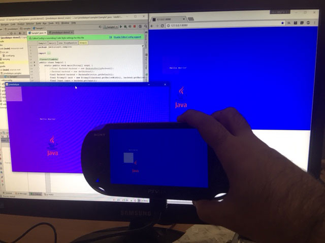

# jmedialayer

A Java Library similar to SDL that works with [JTransc](http://blog.jtransc.com/) to build native applications that work everywhere,
including browser and homebrew platforms like psvita and 3ds.

The idea is to create layers. An initial layer will provide functionality to handle pixel by pixel drawing and basic input. 
An posterior layer will provide accelerated 2d graphics.
And a final layer will provide 3d accelerated graphics with shader support.

## Performance

Even when there are no GC pauses, the raw performance is not perfect. Right now there are lots of `dynamic_cast` involved in jtransc + unnecessary shared_ptr boxing. This will improve in the future without touching any code.

In the meanwhile, in order to optimize critical parts, you can embed C++ code directly. Or use `FastMemByte` and `FastMemInt` classes. Those classes provide static methods to select and use raw pointers directly. Once selected an array, set and get calls just use integers so when no objects/arrays are referenced at all, the performance is as fast as C++ code. So on blitting and stuff, you can just select an array and use integer indices during the algorithm to get the best performance.

https://github.com/jmedialayer/jmedialayer/blob/master/jmedialayer/src/jmedialayer/util/FastMemInt.java
https://github.com/jmedialayer/jmedialayer/blob/master/jmedialayer/src/jmedialayer/util/FastMemByte.java

You can see example of how to use those classes in Bitmap* classes:
https://github.com/jmedialayer/jmedialayer/blob/master/jmedialayer/src/jmedialayer/graphics/Bitmap.java
https://github.com/jmedialayer/jmedialayer/blob/master/jmedialayer/src/jmedialayer/graphics/Bitmap8.java
https://github.com/jmedialayer/jmedialayer/blob/master/jmedialayer/src/jmedialayer/graphics/Bitmap32.java
